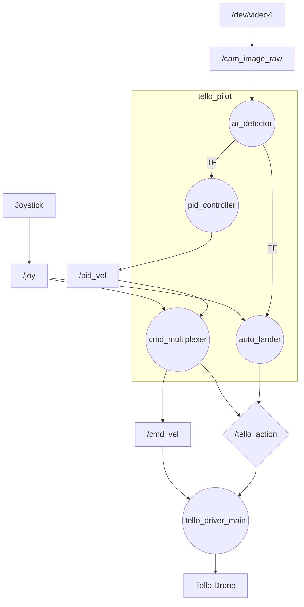
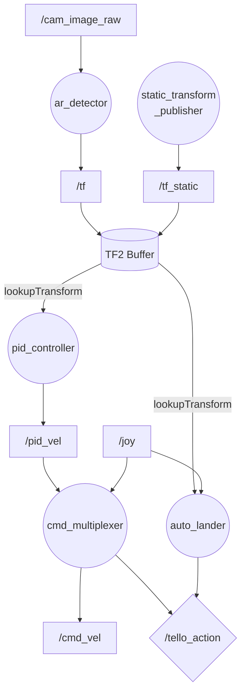

# tello_pilot — Tello 自動着陸パッケージ

地上固定カメラ（上向き）でドローン底面の ARマーカーを検出し、
カメラ真上への自動位置合わせ・着陸を行う ROS2 プロジェクト。

---

## システム構成図

### 全体俯瞰



> 円: ROS ノード　四角: トピック　ひし形: サービス

---

### tello_pilot 内部のデータフロー



---

## ノード一覧

| ノード | パッケージ | 役割 |
|--------|-----------|------|
| `opencv_cam` | opencv_cam | カメラ画像取得 (`/dev/video4`) |
| `static_transform_publisher` | tf2_ros | `camera_cv_frame` → `camera_center_frame` の静的TF配信 |
| `joy_node` | joy | ジョイスティック入力配信 |
| `ar_detector` | tello_pilot | ARマーカー検出・TF動的ブロードキャスト |
| `pid_controller` | tello_pilot | マーカー誤差 → X/Y 速度指令（PID） |
| `cmd_multiplexer` | tello_pilot | 手動 / 自動モード切り替え・テイクオフ/着陸コマンド |
| `auto_lander` | tello_pilot | 収束検出 → 自動着陸コマンド送信 |
| `tello_driver_main` | tello_driver | UDP でドローンと通信 |

---

## 主要トピック

| トピック | 型 | Publisher | Subscriber |
|----------|----|-----------|------------|
| `/cam_image_raw` | sensor_msgs/Image | opencv_cam | ar_detector |
| `/joy` | sensor_msgs/Joy | joy_node | cmd_multiplexer, auto_lander |
| `/tf_static` | tf2_msgs/TFMessage | static_transform_publisher | TF2 Buffer |
| `/tf` | tf2_msgs/TFMessage | ar_detector | TF2 Buffer |
| `/pid_vel` | geometry_msgs/Twist | pid_controller | cmd_multiplexer |
| `/cmd_vel` | geometry_msgs/Twist | cmd_multiplexer | tello_driver_main |
| `/image_ar` | sensor_msgs/Image | ar_detector | —（デバッグ） |
| `/land_direction` | geometry_msgs/Vector3Stamped | ar_detector | —（デバッグ） |
| `/flight_data` | tello_msgs/FlightData | tello_driver_main | —（デバッグ） |
| `/tello_response` | tello_msgs/TelloResponse | tello_driver_main | —（デバッグ） |
| `/image_raw` | sensor_msgs/Image | tello_driver_main | —（ドローンカメラ） |

## サービス

| サービス | 型 | Server | Client |
|----------|----|--------|--------|
| `/tello_action` | tello_msgs/TelloAction | tello_driver_main | cmd_multiplexer, auto_lander |

---

## TF フレーム構成

```
camera_cv_frame  ← OpenCV 画像座標系（原点: 左上、x: 右、y: 下）
    │
    ├─ [static] → camera_center_frame  （オフセット: 画像幅/2, 画像高さ/2）
    │
    └─ [dynamic] → marker_N_frame      （ar_detector がフレームごとに更新）
```

---

## コントローラー操作

`/joy` トピック（sensor_msgs/Joy）のインデックスと機能の対応。
実装ノード: `cmd_multiplexer`（速度・モード切替）、`auto_lander`（収束検出）。

### ボタン（`/joy.buttons[]`）

| 物理ボタン | `/joy` インデックス | 動作 | 実装ノード |
|-----------|-------------------|------|-----------|
| Start（メニュー） | `buttons[7]` | テイクオフ（立ち上がりエッジ） | cmd_multiplexer |
| Back（ビュー） | `buttons[6]` | 手動着陸（立ち上がりエッジ） | cmd_multiplexer |
| RB（右バンパー） | `buttons[5]` | 自動モード（押している間） | cmd_multiplexer, auto_lander |
| LB（左バンパー） | `buttons[4]` | テスト前進（押している間） | cmd_multiplexer |

### 軸（`/joy.axes[]`）

値の範囲: `-1.0`（最大反転）〜 `+1.0`（最大）

| 物理入力 | `/joy` インデックス | 送信先 | 動作（手動モード時） |
|---------|-------------------|--------|---------------------|
| 右スティック 前後 | `axes[4]` | `cmd_vel.linear.x` | 前後スロットル |
| 右スティック 左右 | `axes[3]` | `cmd_vel.linear.y` | 左右ストレーフ |
| 左スティック 前後 | `axes[1]` | `cmd_vel.linear.z` | 上昇・下降 |
| 左スティック 左右 | `axes[0]` | `cmd_vel.angular.z` | yaw 回転 |

### インデックスの確認方法

コントローラーを接続した状態で以下を実行し、ボタンを押して対応するインデックスを確認できる:

```bash
ros2 topic echo /joy
```

`buttons[N]` が `0 → 1` に変わった N が押したボタンのインデックス。

---

## セットアップ

```bash
# 1. カメラの udev ルールを設定（新環境での初回のみ）
bash setup/install_udev.sh

# 2. ビルド
colcon build --packages-skip tello_gazebo
source install/setup.bash

# 3. 起動（実機）
ros2 launch tello_pilot teleop_sse.launch.py

# 4. 起動（カメラ・AR確認のみ、ドローンなし）
ros2 launch tello_pilot cam_dev.launch.py
```
