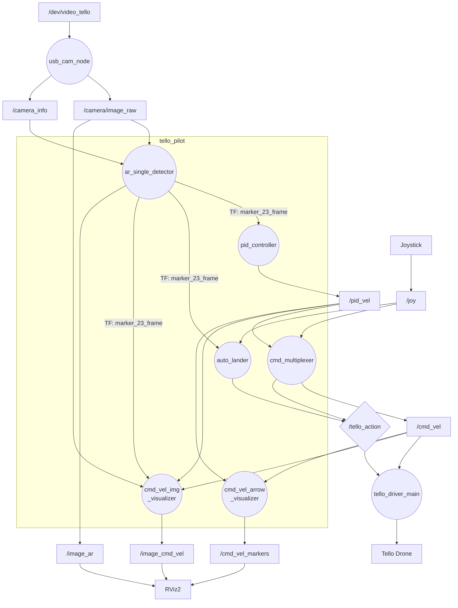

# tello_pilot — Tello 自動着陸パッケージ

地上固定カメラ（上向き）でドローン底面の ARマーカーを検出し、
カメラ真上への自動位置合わせ・着陸を行う ROS 2 プロジェクト。

---

## システム構成図



> 円: ROS ノード　四角: トピック　ひし形: サービス

---

## ノード一覧

| ノード名 | 実行ファイル | パッケージ | 役割 |
|---------|------------|-----------|------|
| `usb_cam_node` | `usb_cam_node_exe` | usb_cam | カメラ画像取得 (`/dev/video_tello`) |
| `ar_single_detector` | `ar_single_detector_node` | tello_pilot | ARマーカー検出・TF動的ブロードキャスト |
| `pid_controller` | `pid_controller_node` | tello_pilot | マーカー誤差 → X/Y 速度指令（PID） |
| `cmd_multiplexer` | `cmd_multiplexer_node` | tello_pilot | 手動/自動モード切り替え・テイクオフ/着陸コマンド |
| `auto_lander` | `auto_lander_node` | tello_pilot | 収束検出 → 自動着陸コマンド送信 |
| `cmd_vel_img_visualizer` | `cmd_vel_img_visualizer_node` | tello_pilot | 速度指令を画像にオーバーレイして publish |
| `cmd_vel_arrow_visualizer` | `cmd_vel_arrow_visualizer_node` | tello_pilot | 速度指令を RViz MarkerArray で表示 |
| `tello_driver_main` | `tello_driver_main` | tello_driver | UDP でドローンと通信 |

---

## 主要トピック・サービス

| トピック/サービス | 型 | Publisher | Subscriber |
|------------------|----|-----------|------------|
| `/camera/image_raw` | sensor_msgs/Image | usb_cam_node | ar_single_detector, cmd_vel_img_visualizer |
| `/camera_info` | sensor_msgs/CameraInfo | usb_cam_node | ar_single_detector |
| `/joy` | sensor_msgs/Joy | joy_node | cmd_multiplexer, auto_lander |
| `/tf` | tf2_msgs/TFMessage | ar_single_detector | TF2 Buffer |
| `/pid_vel` | geometry_msgs/Twist | pid_controller | cmd_multiplexer, cmd_vel_img_visualizer, cmd_vel_arrow_visualizer |
| `/cmd_vel` | geometry_msgs/Twist | cmd_multiplexer | tello_driver_main, cmd_vel_img_visualizer, cmd_vel_arrow_visualizer |
| `/image_ar` | sensor_msgs/Image | ar_single_detector | —（RViz デバッグ表示） |
| `/image_cmd_vel` | sensor_msgs/Image | cmd_vel_img_visualizer | —（RViz デバッグ表示） |
| `/cmd_vel_markers` | visualization_msgs/MarkerArray | cmd_vel_arrow_visualizer | —（RViz デバッグ表示） |
| `/tello_action` (service) | tello_msgs/TelloAction | — | cmd_multiplexer, auto_lander → tello_driver_main |

---

## TF フレーム構成

```
world
  └─(static TF: identity, launch で定義)─► camera_frame
      └─(ar_single_detector が毎フレーム broadcast)─► marker_23_frame
          │  translation: tvec [m]（estimatePoseSingleMarkers の生の値）
          │  rotation   : ArUco の生の姿勢（R_x180 補正なし）
          └─(static TF, Rx(180°), launch で定義)─► drone_frame
```

（矢印はTF親子関係。子フレームの位置を親フレーム座標系で表現）

- 座標単位: `[m]`
- `pid_controller` / `auto_lander` は `lookupTransform("camera_frame", "drone_frame")` を使用
- PID 計算は `camera_frame`（固定フレーム）で行い、出力を `drone_frame` に変換してから publish する
- **変更予定**: 複数ARマーカー（ID: 23, 9, 20, 21, 26）による認識率向上に伴い、TFツリー構造が変わる可能性がある

---

## ARマーカー

- 辞書: `DICT_4X4_50`
- 使用ID: **23, 9, 20, 21, 26**（複数マーカーによる認識率向上のため印刷済み）
- 現在の検出対象: ID=23 のみ（`ar_single_detector_node.cpp` の `kMarkerId`）
- マーカーサイズ: `kMarkerLength = 0.03 [m]`（推定精度に影響するため実測値を設定すること）
- 生成スクリプト: `ar_marker/gen_five_ar.py`

---

## カメラ設定

- デバイス: `/dev/video_tello`（udev シンボリックリンク）
- 解像度: 640×480
- フォーマット: **YUYV @ 25fps**（現在採用）
  - 低遅延・高fps な MJPEG を使いたいが、画質が荒くなる場合があるため YUYV を使用中
  - MJPEG で安定した画質が得られれば切り替えを検討（launch ファイルの `pixel_format`・`framerate` を変更するだけ）
- キャリブレーション: `config/ost.yaml`

---

## コントローラー操作

### ボタン（`/joy.buttons[]`）

| 物理ボタン | インデックス | 動作 |
|-----------|------------|------|
| Start | `buttons[7]` | テイクオフ（立ち上がりエッジ） |
| Back | `buttons[6]` | 手動着陸（立ち上がりエッジ） |
| RB（右バンパー） | `buttons[5]` | 自動モード（押している間） |
| LB（左バンパー） | `buttons[4]` | テスト前進（押している間） |

### 軸（`/joy.axes[]`、手動モード時）

| 物理入力 | インデックス | 対応する cmd_vel |
|---------|------------|-----------------|
| 右スティック 前後 | `axes[4]` | `linear.x`（前後） |
| 右スティック 左右 | `axes[3]` | `linear.y`（左右） |
| 左スティック 前後 | `axes[1]` | `linear.z`（上下） |
| 左スティック 左右 | `axes[0]` | `angular.z`（yaw） |

---

## セットアップ・起動

```bash
# ビルド（ワークスペースルートから）
colcon build --event-handlers console_direct+
source install/setup.bash

# 起動（実機）
ros2 launch tello_pilot tello_test.launch.py
```
